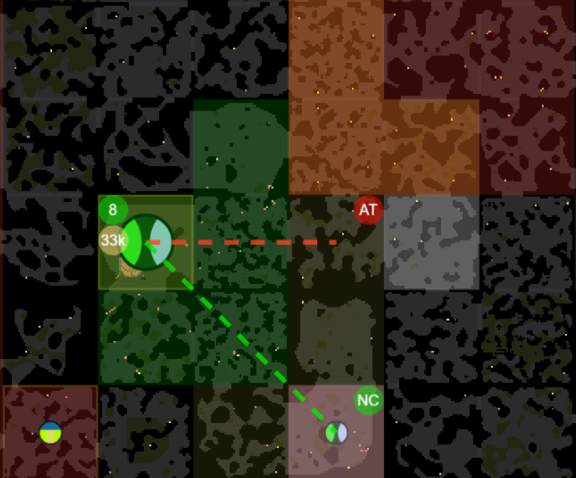
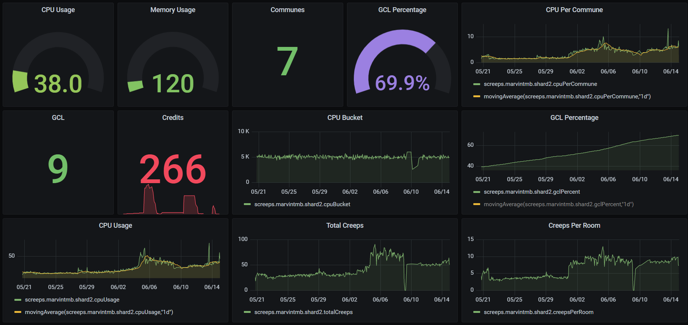

<div align="center">
  

</div>

[](https://forthebadge.com)
[](https://forthebadge.com)
[](https://forthebadge.com)

[](https://github.com/The-International-Screeps-Bot/The-International-Open-Source/actions/workflows/CD.yml)

## About

The International is my bot for [Screeps](https://screeps.com/), thematically based after [communist](https://en.wikipedia.org/wiki/Communism) aesthetics. Owned rooms are called communes, offensive and defensive forces are called the Red Army, economic workers are known as the Proletariat, and the Revolutionaries establish new communes and rebuild destroyed ones.

This bot can provide experienced and new players a reference for when they get stuck, need inspiration, or want to laugh at some terrible code. Comments are used commonly, and code is structured so it can be easily understood, replicated, and expanded upon. Please follow similar guidelines if you make a pull request 🙂.

Feel welcome to fork it and otherwise use it, however do not be overly aggressive on the Screeps world, especially to newer players. The bot is intended to be automated, but can perform manual actions via the console. It has an information panel showing progress, events, economy, military, and more.

If you have specific questions or want to discuss the bot, please join our discord server.

[](https://discord.gg/5QubDsB786)





## Progress and Design

[Progress board](https://trello.com/b/l6Min9hr/typescript-international-screeps-bot)

[Videos](https://www.youtube.com/playlist?list=PLGlzrjCmziEj7hQZSwcmkXkMXgkQXUQ6C)

[My screeps profile](https://screeps.com/a/#!/profile/MarvinTMB)

## Requirements

Please read the about section before installing and using this bot.

First you'll want to download or fork the repository.

### NPM

Next, if you don't have it already, install Node Package Manager so we can install other things:

```powershell
npm install
```

Then, when in the project folder, you'll want to install the devDependencies like so:

```powershell
npm install --only=dev
```

And that's it. Join our [discord server](https://discord.gg/5QubDsB786) if you need help.

## Usage

Before you use this bot, please consider two things. First, if you're a new player and especially one that wants to learn programming, JS, or TS, then this is not the place to start. I strongly encourage you to start your own bot and achieve a decent economy before using or contributing to this bot.

Secondly, DO NOT USE THIS BOT TO BULLY. Do not attack noobs, taking their remotes or claimed rooms. This is a fun game where people often program their own bots from scratch, so it is entirely fun-ruining and incredibly rude to pick on those who aren't using an open source bot like this one. If you find yourself against another open source bot, or a bot that can put up a fair fight against you, then best of luck. Please feel welcome to share experiences or ask questions in the [discord server](https://discord.gg/5QubDsB786).

Using [rollup](https://rollupjs.org/guide/en/) we will translate the code into a single js file, which will be used in environments set in the screeps.json file. This reduces cpu usage, and compiles the code so it can be run by Screeps while we develop using folders and typescript.

First, rename example.screeps.json to screeps.json and fill in the required information for each environment you want to run the bot in.

To then run the bot, use the command `npm run push-mmo` replacing mmo with the environment you want to compile to. This wiil initially compile to the environment, as well as automatically compiling and pushing to the environment on code changes.

For more information, please go to the [wiki](https://github.com/CarsonBurke/The-International-Screeps-Bot/wiki/Usage)

### Grafana

You can set up [grafana](https://grafana.com/), a graphing and stat recording tool, using the screepsplus supported tool [hosted agent](https://screepspl.us/services/grafana/). With this, metrics recorded in Memory.stats can be viewed. There is a JSON model in this repository, grafanaModel.json which you can copy and paste to use to instantiate your graphs.

### Private server

To run the bot on the performance server, run `npm run server` and check out the server and `localhost:3000` in your browser.

If you'd like to use rollup to compile to a private server, you'll need to download and configure [screepsmod-auth](https://github.com/ScreepsMods/screepsmod-auth) to push your code.

I'd also suggest using this less-laggy tool [steamless-client](https://github.com/laverdet/screeps-steamless-client ) to watch your private server run from the comfort of your browser.

## Contribution

We're a huge fan of teamwork, and many useful features of this bot have been added by contributors.

If you want to join us in development for this bot, please join our [discord server](https://discord.gg/5QubDsB786) and share what you're working on, or hoping to add. We're happy to review issues, merge pull requests, and add collaborators!

## Support

If you'd like to support the project, Carson Burke (AKA MarvinTMB) is happy to accept single time or monthly donations through the following links.

[Paypal](https://paypal.me/carsonburke22)

[Patreon](https://www.patreon.com/Marvin22)
