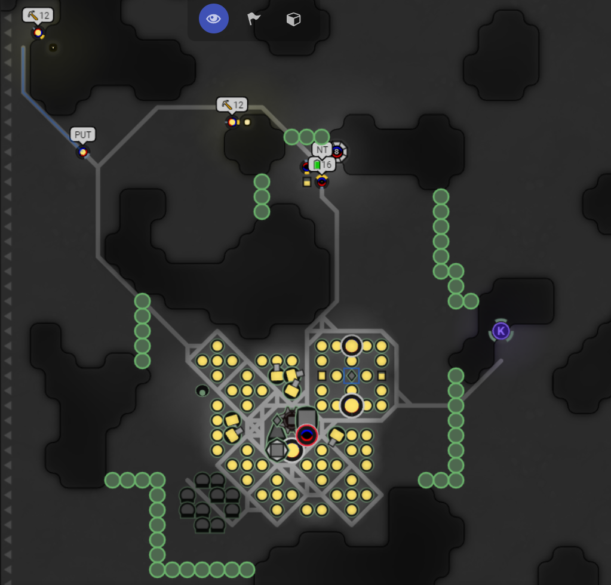

# The International - a fully automated Screeps bot


[](https://forthebadge.com)
[](https://forthebadge.com)
[](https://forthebadge.com)
[](https://forthebadge.com)

## About

The International is my bot for the MMO server, thematically based after communist aesthetics. The goal of The International is to set up a fully autonomous communism zone in shard 2. Owned rooms are called communes, offensive and defensive forces are called the Red Army, economic workers are known as the Proletariat, and the Revolutionaries establish new communes and rebuild destroyed ones.

This bot intended to provide experienced and new players a reference for when they get stuck, need inspiration, or want to laugh at some terrible code. Feel welcome to fork it and otherwise use it, however do not be overly aggressive on the Screeps world, especially to newer players. The bot is intended to be automated, but can perform manual actions via the console, and has an information panel showing progress, events, economy and military, as well as, if integrated, the current state and events allies are undergoing.

Please create an issue for feature requests or help. I'll add a usage guide sometime soon. If you have specific questions or want to discuss the bot, DM me on discord: Carson Burke A&0#6757.




## Requirements

Please read the about section before installing and using this bot.

### NPM

```
npm install
```

### Typescript

```
npm install -g typescript
```

### Rollup

```
npm install -g rollup
```

## Progress

### Progress Board

https://trello.com/b/BIZ8G8je/the-internationale-screeps-bot

### Flowchart

(I haven't done much work on the flowchart yet)
