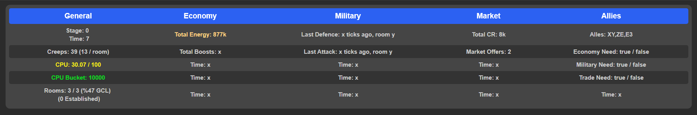

# The Internationale - a fully automated Screeps bot

## About

The Internationale is my bot for the MMO server, thematically based after communist aesthetics. The goal of The Internationale is to set up a fully autonomous communism zone in shard 2. Owned rooms are called communes, offensive and defensive forces are called the Red Army, economic workers are known as the Proletariat, and the Revolutionaries establish new communes and rebuild destroyed ones.

The bot is not meant for use or forking, please do not use it as such. It is simply intented to provide experienced and new players a reference for when they get stuck, need inspiration, or want to laugh at some terrible code. The bot is intended to be automated, but can perform manual actions via the console, and has an information panel showing progress, events, economy and military, as well as, if integrated, the current state and events allies are undergoing.

## Progress

- [x] Automated spawning
- [x] Claim and operation of multiple rooms
- [x] Remote mining
- [x] Primitive defence code
- [x] Operation of multiple spawns in a room
- [x] Spawn que
- [x] Automated road placement
- [x] Automated base construction and room planning
- [x] Automatic market buy and sell orders
- [x] Produce boosts
- [x] Attacker dous
- [ ] Have resources come into terminal when room under attack
- [ ] Spawning of power creeps
- [ ] Power creep operations
- [ ] Creep boosting
- [x] Automated wall and rampart placement
- [ ] Power bank collection
- [ ] Commodity collection
- [x] Automated scouting
- [ ] Factory operations
- [ ] Automated intel on enemies
- [ ] Automated attacking
- [ ] Different, functional room blueprints depending on room size and shape
- [ ] Automated recording of viable rooms to claim
- [ ] Automated claiming of rooms
- [x] Automated recording of viable remote harvesting rooms
- [x] Add room and map visuals to display important information
- [ ] Power creep offensive capabilities
- [ ] Automatic safemode when boosted attackers
- [ ] Advanced targeting for towers
- [ ] Recording and predicting for like attackers
- [ ] Assisting of defending rooms using safe rooms in case of power creep assisted attack
- [ ] Weighting of rooms from economic to military depending on recent history and neighbours
- [x] Communication and coordination between rooms about global stage, economy, threats
- [ ] Advanced pathing to avoid rooms with known threats
- [x] Have nearest rooms establish and claim rooms
- [ ] Spawn specific defender creeps depending on attackers
- [ ] Determine if boosting is necessary for defenders
- [x] Have defenders move to ramparts near attackers
- [x] Spawn new civilian creeps when TTL is less than time to spawn
- [ ] Add a GUI for performing manual actions from the console
- [x] Information panel to provide information about the development of the bot
- [ ] Communication with allies via the public segment
- [ ] Create a task manager to avoid creeps switching tasks halfway through
- [ ] Make the task manager track and tell creeps what jobs to do
- [ ] Track remote room attacks from enemy players and run logic to abolish it, defend it, or leave it as is
- [ ] Create GCL temples if there is excess energy and proper globalStage

## Flowchart and more information

https://www.figma.com/file/V2GQYIqNXkntW3Rgp19ris/The-Proletarian-Commune-Screeps
